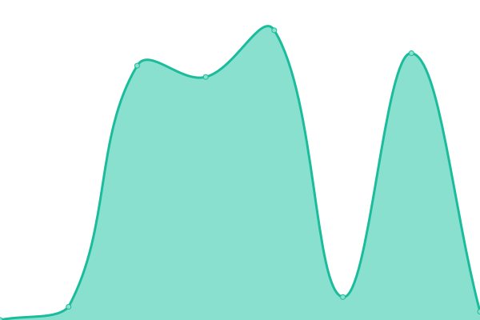
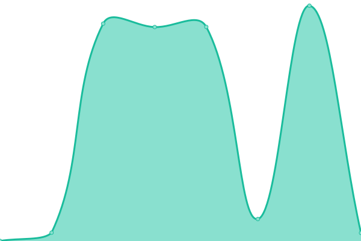

# [📈 Live Status](https://TFPJobs.github.io/ex_status_page): <!--live status--> **🟩 All systems operational**

This repository contains the open-source uptime monitor and status page for [TFPJobs](https://TFPJobs.github.io/ex_status_page), powered by [Upptime](https://github.com/upptime/upptime).

With [Upptime](https://upptime.js.org), you can get your own unlimited and free uptime monitor and status page, powered entirely by a GitHub repository. We use [Issues](https://github.com/TFPJobs/ex_status_page/issues) as incident reports, [Actions](https://github.com/TFPJobs/ex_status_page/actions) as uptime monitors, and [Pages](https://TFPJobs.github.io/ex_status_page) for the status page.

<!--start: status pages-->
<!-- This summary is generated by Upptime (https://github.com/upptime/upptime) -->
<!-- Do not edit this manually, your changes will be overwritten -->
<!-- prettier-ignore -->
| URL | Status | History | Response Time | Uptime |
| --- | ------ | ------- | ------------- | ------ |
|  [Exchange User Portal](https://bwex-user-prod.vercel.app/) | 🟩 Up | [exchange-user-portal.yml](https://github.com/TFPJobs/ex_status_page/commits/HEAD/history/exchange-user-portal.yml) | 

 2009ms
     
 | 

<a href="https://TFPJobs.github.io/ex_status_page/history/exchange-user-portal">100.00%</a>
    

|  [Exchange User Portal QA](https://bwex-user-qa.vercel.app/) | 🟩 Up | [exchange-user-portal-qa.yml](https://github.com/TFPJobs/ex_status_page/commits/HEAD/history/exchange-user-portal-qa.yml) | 

 2626ms
     
 | 

<a href="https://TFPJobs.github.io/ex_status_page/history/exchange-user-portal-qa">100.00%</a>
    

|  [Exchange Admin Portal](https://bwex-admin-prod.vercel.app/) | 🟩 Up | [exchange-admin-portal.yml](https://github.com/TFPJobs/ex_status_page/commits/HEAD/history/exchange-admin-portal.yml) | 

 2749ms
     
 | 

<a href="https://TFPJobs.github.io/ex_status_page/history/exchange-admin-portal">100.00%</a>
    

|  [Exchange Admin Portal QA](https://bwex-admin-qa.vercel.app/) | 🟩 Up | [exchange-admin-portal-qa.yml](https://github.com/TFPJobs/ex_status_page/commits/HEAD/history/exchange-admin-portal-qa.yml) | 

 2087ms
     
 | 

<a href="https://TFPJobs.github.io/ex_status_page/history/exchange-admin-portal-qa">100.00%</a>
    

|  [Exchange API](https://exchange1.bitwage.com/) | 🟩 Up | [exchange-api.yml](https://github.com/TFPJobs/ex_status_page/commits/HEAD/history/exchange-api.yml) | 

 1644ms
     
 | 

<a href="https://TFPJobs.github.io/ex_status_page/history/exchange-api">100.00%</a>
    

|  [Exchange API QA](https://exchange2.bitwage.com/) | 🟩 Up | [exchange-api-qa.yml](https://github.com/TFPJobs/ex_status_page/commits/HEAD/history/exchange-api-qa.yml) | 

 2515ms
     
 | 

<a href="https://TFPJobs.github.io/ex_status_page/history/exchange-api-qa">100.00%</a>
    

<!--end: status pages-->

[**Visit our status website →**](https://TFPJobs.github.io/ex_status_page)

## 📄 License

- Powered by: [Upptime](https://github.com/upptime/upptime)
- Code: [MIT](./LICENSE) © [TFPJobs](https://TFPJobs.github.io/ex_status_page)
- Data in the `./history` directory: [Open Database License](https://opendatacommons.org/licenses/odbl/1-0/)
